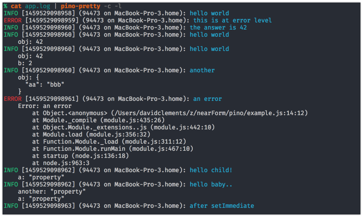

# pino&nbsp;&nbsp;[](https://travis-ci.org/pinojs/pino)&nbsp;[](https://coveralls.io/github/pinojs/pino?branch=master) [](http://standardjs.com/) [](https://definitelytyped.org)

[Very low overhead](#low-overhead) Node.js logger, inspired by Bunyan.

## Documentation

* [Benchmarks ⇗](/docs/benchmarks.md)
* [API ⇗](/docs/api.md)
* [Browser API ⇗](/docs/browser.md)
* [Redaction ⇗](/docs/redaction.md)
* [Child Loggers ⇗](/docs/child-loggers.md)
* [Transports ⇗](/docs/transports.md)
* [Web Frameworks ⇗](/docs/web.md)
* [Pretty Printing ⇗](/docs/pretty.md)
* [Extreme Mode ⇗](/docs/extreme.md)
* [Ecosystem ⇗](/docs/ecosystem.md)
* [Legacy](/docs/legacy.md)
* [Help ⇗](/docs/help.md)

## Install

```
$ npm install pino
```

## Usage

```js
const logger = require('pino')()

logger.info('hello world')

const child = logger.child({ a: 'property' })
child.info('hello child!')
```

This produces:

```
{"level":30,"time":1531171074631,"msg":"hello world","pid":657,"hostname":"Davids-MBP-3.fritz.box"}
{"level":30,"time":1531171082399,"msg":"hello child!","pid":657,"hostname":"Davids-MBP-3.fritz.box","a":"property"}
```

For using Pino with a web framework see:

* [Pino with Fastify](docs/web.md#fastify)
* [Pino with Express](docs/web.md#express)
* [Pino with Hapi](docs/web.md#hapi)
* [Pino with Restify](docs/web.md#restify)
* [Pino with Koa](docs/web.md#koa)
* [Pino with Node core `http`](docs/web.md#http)


<a name="essentials"></a>
## Essentials

### Development Formatting

The [`pino-pretty`](https://github.com/pinojs/pino-pretty) module can be used to
format logs during development:



### Transports & Log Processing

Due to Node's single-threaded event-loop, it's highly recommended that sending,
alert triggering, reformatting and all forms of log processing
is conducted in a separate process. In Pino parlance we call all log processors
"transports", and recommend that the transports be run as separate
processes, piping the stdout of the application to the stdin of the transport.

For more details see our [Transports⇗](docs/transports.md) document.

### Low overhead

Using minimum resources for logging is very important. Log messages
tend to get added over time and this can lead to a throttling effect
on applications – such as reduced requests per second.

In many cases, Pino is over 5x faster than alternatives.

See the [Benchmarks](docs/benchmarks.md) document for comparisons.

<a name="team"></a>
## The Team

### Matteo Collina

<https://github.com/pinojs>

<https://www.npmjs.com/~matteo.collina>

<https://twitter.com/matteocollina>

### David Mark Clements

<https://github.com/davidmarkclements>

<https://www.npmjs.com/~davidmarkclements>

<https://twitter.com/davidmarkclem>

### James Sumners

<https://github.com/jsumners>

<https://www.npmjs.com/~jsumners>

<https://twitter.com/jsumners79>

### Thomas Watson Steen

<https://github.com/watson>

<https://www.npmjs.com/~watson>

<https://twitter.com/wa7son>

## Communication

### Chat on Gitter

<https://gitter.im/pinojs/pino>

### Chat on IRC

You'll find an active group of Pino users in the #pinojs channel on Freenode, including some of the contributors to this project.

## Contributing

Pino is an **OPEN Open Source Project**. This means that:

> Individuals making significant and valuable contributions are given commit-access to the project to contribute as they see fit. This project is more like an open wiki than a standard guarded open source project.

See the [CONTRIBUTING.md](https://github.com/pinojs/pino/blob/master/CONTRIBUTING.md) file for more details.

<a name="acknowledgements"></a>
## Acknowledgements

This project was kindly sponsored by [nearForm](http://nearform.com).

Logo and identity designed by Cosmic Fox Design: https://www.behance.net/cosmicfox.

## License

Licensed under [MIT](./LICENSE).

[elasticsearch]: https://www.elastic.co/products/elasticsearch
[kibana]: https://www.elastic.co/products/kibana
